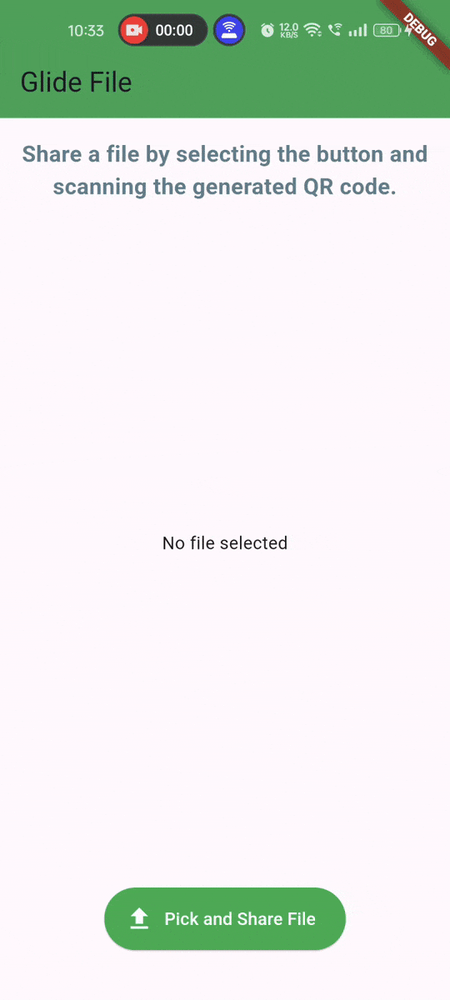

# GlideFile - File Sharing App

A simple file-sharing application built with Flutter, allowing users to share files via QR codes.

## Features

- **Pick Files:** Users can select files from their device to share.
- **Generate QR Code:** The app generates a QR code for the selected file.
- **Share QR Code:** Users can share the QR code with others.
- **Scan QR Code:** Recipients can scan the QR code to download the shared file.
- **Firebase Integration:** The app uses Firebase Storage to upload and share files.

## Getting Started

To get started with this project, follow these steps:

### Prerequisites

- Flutter installed on your machine
- An active Firebase project

### Installation

1. **Clone the repository:**

   ```bash
   git clone https://github.com/McFlurinivas/GlideFile---File-Sharing-App.git

2. **Navigate to the project directory.**
3. **Install dependencies:**
   
    ```bash
    flutter pub get
5. **Set up Firebase:**
    - Add your google-services.json file to android/app directory for Android.
    - Add your GoogleService-Info.plist file to ios/Runner directory for iOS.
    - Ensure that Firebase Storage is enabled in your Firebase project.

5. **Run the app:**
   
    ```bash
    flutter run

### Usage

1. Open the app: Launch the File Sharing App on your device.
2. Pick a file: Tap on the "Pick and Share File" button to select a file.
3. Share the QR code: Once the QR code is generated, share it with the recipient.
4. Scan the QR code: The recipient can scan the QR code to download the shared file.

### App Overview:



